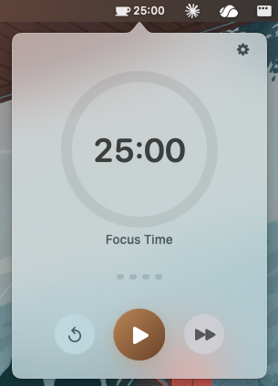
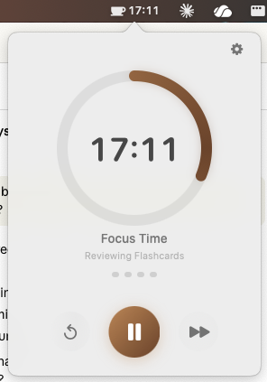
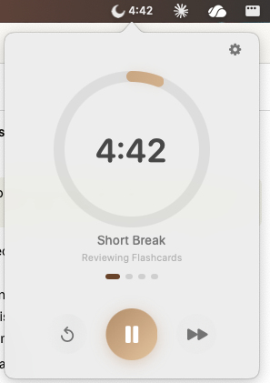

# Coffee Break — Focus Timer for macOS

A minimal, polished focus timer that lives in your macOS menu bar. Built with Swift, SwiftUI, and AppKit.

## Screenshots

<p align="center">
  
  
  
</p>


## Install

1. Download **Coffee-Break.zip** from the [latest release](https://github.com/me1anius/pomodoro-macOS/releases/latest)
2. Unzip it
3. Drag **Coffee Break.app** to your Applications folder
4. Open it — the coffee cup icon will appear in your menu bar

> **Note:** On first launch, macOS may block the app. Go to **System Settings → Privacy & Security**, scroll down, and click **Open Anyway** to allow it.

Works on Apple Silicon and Intel Macs running **macOS 13.0+** (Ventura or later).

## Features

- **Menu bar native** — no Dock icon, no main window. Just a clean status item with live countdown
- **Coffee-themed UI** — warm brown colour scheme, circular progress ring, frosted glass background, spring animations
- **Onboarding tutorial** — interactive walkthrough on first launch to get you started
- **Global keyboard shortcuts** — customisable hotkeys for start/pause, skip, and reset
- **Configurable** — work/break durations, auto-start, sound toggles, all persisted across launches
- **Smart session flow** — automatic work → short break → work → ... → long break cycling
- **Session naming** — name your focus phases with a bookmark system to save and reuse labels
- **Saved labels** — comes with defaults, add your own in Settings or save on-the-fly with the bookmark icon
- **Clock tick sound** — optional realistic clock tick each second
- **Swipe gestures** — optional two-finger swipe to navigate between timer and settings
- **Notifications** — macOS notifications + chime sound on session transitions
- **Light & Dark mode** — follows system appearance automatically

## Usage

- Click the ☕ in the menu bar to open the popover
- On first launch, a quick tutorial walks you through the features
- Press **Play** to start a 25-minute focus session
- The menu bar shows a live countdown: `☕ 18:32`
- During breaks, the icon switches to a 🌙 moon
- Hover below the timer to name your phase — tap the **bookmark** icon to save it for reuse
- When a session ends, you'll hear a chime and see a notification
- Click the **gear icon** to adjust durations, sounds, and keyboard shortcuts
- Right-click the menu bar icon to quit

## Customisation

All settings are persisted via `UserDefaults` and survive app restarts:

| Setting | Default |
|---------|---------|
| Focus duration | 25 min |
| Short break | 5 min |
| Long break | 15 min |
| Sessions before long break | 4 |
| Auto-start breaks | Off |
| Auto-start focus sessions | Off |
| Sound on session end | On |
| Tick sound | Off |
| Show timer in menu bar | On |
| Swipe to open settings | Off |

## Build from Source

If you'd prefer to build it yourself, no Xcode required — just the Command Line Tools:

```bash
xcode-select --install   # if not already installed
cd pomodoro-macOS
chmod +x build.sh
./build.sh
cp -r "build/Coffee Break.app" /Applications/
```

## Project Structure

```
Pomodoro/
├── Sources/
│   ├── PomodoroApp.swift          # @main entry point
│   ├── AppDelegate.swift          # Sets up NSStatusItem + NSPopover
│   ├── MenuBarController.swift    # Manages menu bar item and popover
│   ├── HotkeyManager.swift        # Global keyboard shortcuts (Carbon API)
│   ├── TimerViewModel.swift       # Core timer logic (ObservableObject)
│   ├── TimerView.swift            # Main popover UI (progress ring + controls)
│   ├── SettingsView.swift         # Inline settings panel
│   ├── ProgressRing.swift         # Circular progress component
│   ├── OnboardingView.swift        # First-launch tutorial walkthrough
│   ├── NotificationManager.swift  # macOS notifications + sound
│   └── Constants.swift            # Defaults, colours, sizing
├── Resources/                     # Audio (tick sound)
├── Assets.xcassets/               # App icon asset catalog
├── Info.plist                     # LSUIElement = YES (no Dock icon)
└── Pomodoro.entitlements          # App sandbox
```
